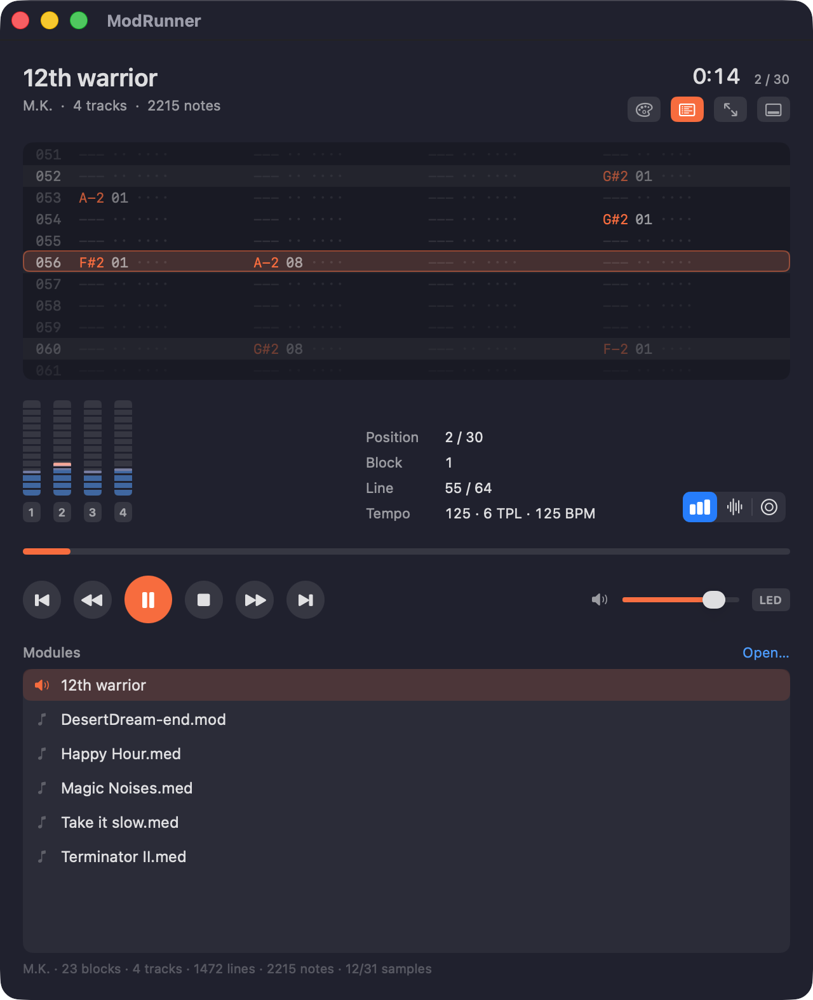
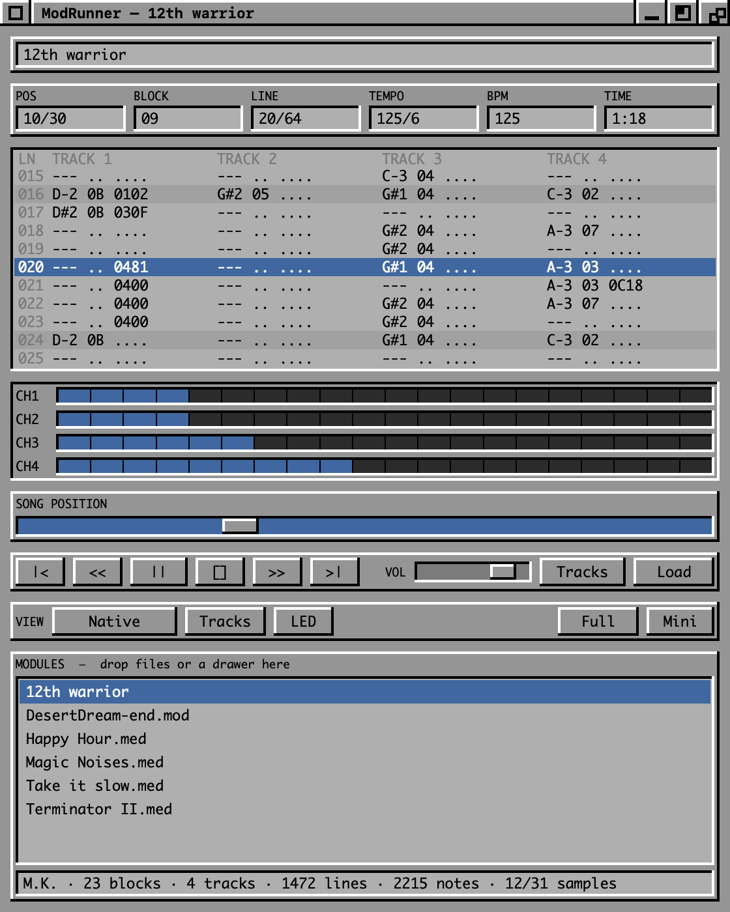

# ModRunner

[](https://github.com/lasse-tech/modrunner/releases/latest)


A small macOS player for Amiga tracker modules — MED, OctaMED and ProTracker —
from the late eighties and early nineties, presented in the style of the
AmigaOS 3.x Workbench interface.

| Native | Workbench |
|---|---|
|  |  |

*The same module, the same replayer, the two interfaces — switchable mid-song
with ⌘1 and ⌘2.*

## What it does

- Reads **MMD0** and **MMD1** MED/OctaMED modules (MMD2/MMD3 are detected and
  reported, not played) and **ProTracker `.mod`** files (`M.K.`, `M!K!`, `FLT4`,
  `xxCH` and friends, 2 to 32 channels)
- Paula-style replayer: per-voice period, volume and looping, Catmull-Rom resampling
- Effects `0x00`–`0x0F`: arpeggio, pitch slides, portamento, vibrato, tremolo,
  volume slides, TPL slider, position jump, set volume (including the `$80`–`$C0`
  range that rewrites an instrument's default volume), and the `0x0F` misc group
  (tempo, pattern break, note delay by half/third/two-thirds of a line,
  retrigger, set-pitch-without-replay, note off, end of song)
- Extended MMD1 effects `0x11`–`0x1F`: single-tick pitch and volume slides,
  ProTracker-style vibrato, set finetune, line loop, cut note, sample start
  offset, jump to next sequence entry, replay line, note delay and retrigger
- Playlist with drag & drop; drop a single module or a whole drawer
- **Two interfaces**, switchable at any time from the View menu (⌘1 / ⌘2) or the
  buttons in the window itself. They share the model and the replayer, so
  switching mid-song changes nothing you hear:
  - **Native** — system materials and typography, SF Symbols, the ModRunner
    palette, a continuously scrolling tracker and animated level meters
  - **Workbench** — the AmigaOS 3.x re-creation, chunky and discrete on purpose
- Tracker view: the note data of the current block moving under a fixed
  playhead, in OctaMED's notation, with beat lines marked — toggle it with the
  **Tracks** button or ⌘T, and the window resizes to match
- **Full-screen player** (⌃⌘F, or the green window gadget) — the pattern as big
  as the display allows, scrolling under a fixed playhead, with the information
  strips fading away while the mouse is still. Esc leaves, space plays, ←/→ move
  by position.
- **Mini player** (⌃⌘M) — a floating strip that stays above other windows while
  you work
- Both follow whichever interface is selected, in the same two styles
- **Recently played**, in the File menu — recorded when a module is actually
  played, not when a folder of them is loaded
- **English and German**, following the system language unless told otherwise in
  Settings (⌘,)
- Per-voice level meters with mute and solo, song position scrubbing,
  transport, volume
- The Amiga output filter, switchable (⌘F). An A500 put a fixed RC stage and a
  switchable two-pole Butterworth between Paula and the sockets, and a lot of
  period music was written through them. Off by default, so playback stays
  comparable with other players.
- Opens modules passed on the command line or double-clicked in the Finder

Synthetic and hybrid instruments are parsed but stay silent — they need OctaMED's
waveform sequencer, which is not implemented. MIDI instruments are silent too.

## Install

Download the disk image from the
[latest release](https://github.com/lasse-tech/modrunner/releases/latest), open
it and drag ModRunner into your Applications folder. The app is signed with a
Developer ID certificate and notarised by Apple, so it opens on first
double-click — no right-click-Open, no trip through System Settings.

## Build and run

```sh
make build      # compile
make test       # loader + replayer tests
make app        # build/ModRunner.app
make run        # build and play the bundled examples
make install    # copy the app into /Applications
make associate  # open .med and .mod files with ModRunner
make help       # every target, with the variables you can override
```

Requires macOS 13+ and a Swift 6 toolchain. There are **no third-party
dependencies** — only Apple's own SwiftUI, AppKit and AVFoundation.

You can also point the app at your own modules:

```sh
open build/ModRunner.app --args ~/path/to/modules
```

Modules can be dropped onto the window, opened from the Finder, or passed on the
command line — individually or as a whole folder.

## Command line

The engine is a library (`ModRunnerKit`), and `modrunner` is a second front end
on top of it — scriptable, and usable where there is no window server:

```sh
modrunner info   <module>...             format, size, instruments, duration
modrunner render <module> -o out.wav     16-bit stereo WAV; -o - writes to stdout
modrunner dump   <module> [--block N]    pattern data as text
modrunner play   <module>...             live, needs an audio device
```

`info`, `render` and `dump` need nothing but a filesystem, so a collection can be
swept in a shell loop or in CI; a module that fails to load is a non-zero exit
code. `play` needs a logged-in session with an output device and says so plainly
when it has none.

```sh
make cli                                     # build it
make info MODULE="Examples/Happy Hour.med"   # or run it through make
```

## Examples

`Examples/` holds four MED modules from 1993 by the author of this repository,
originally released as the *Magic Noises* collection. They are what the test
suite renders and what `make run` plays. See `Examples/README.md` — they are not
covered by the source licence.

## Accuracy

Playback is checked against [libxmp](https://xmp.sourceforge.net/) rendering the
same module. Every figure below is over the four modules in `Examples/`, so it
can be reproduced from a clone:

| Module | ModRunner | libxmp | Envelope correlation | Best lag |
|---|---|---|---|---|
| Happy Hour | 207.34 s | 207.36 s | **0.991** | 0 ms |
| Magic Noises | 192.62 s | 192.64 s | **0.977** | 0 ms |
| Take it slow | 253.42 s | 253.44 s | **0.994** | 0 ms |
| Terminator II | 245.75 s | 245.76 s | **0.909** | 0 ms |

Envelope correlation is over 20 ms RMS windows. Note timing is not in question —
every module lands within 20 ms of the reference over four minutes, and the best
lag is zero throughout. What differs is level: the residual is the resampling
kernel and the mixer's stereo separation. *Terminator II* is the weakest of the
four and has not been run down to a specific effect; it is the module to reach
for when working on mixing accuracy.

ProTracker `.mod` files run through the same replayer as MED modules — there is
no second code path — but the figures above are MED only, since the repository
ships no `.mod` file to measure.

To reproduce, with `xmp` on the path:

```sh
make cli
.build/debug/modrunner render "Examples/Happy Hour.med" -o /tmp/ours.wav
xmp -q -d wav -o /tmp/reference.wav "Examples/Happy Hour.med"
```

To export a render for listening:

```sh
make render MODULE="Examples/Take it slow.med" SECONDS=60 WAV=build/out.wav
```

## Format documentation

`docs/` carries Teijo Kinnunen's specification, which is the authoritative source
for the format:

- `MMD_FileFormat.txt` — Revision 6 (01.02.1996), covers MMD0/MMD1/MMD2/MMD3
- `MED-Format-rev1.txt` — Revision 1 (25.04.1992), MMD0/MMD1 only, and explicitly
  placed in the public domain by its author

The specification does **not** document the effect command set. That lives in
Appendix A and B of the *OctaMED SoundStudio V1.03c Manual* (© RBF Software
1997), which is the authoritative source for effect semantics and is what the
effect handling here was built and corrected against.

That manual is marked **"NOT PUBLIC DOMAIN"** and is therefore deliberately not
included in this repository.

The tempo conversion was cross-checked against OpenMPT's `soundlib/Load_med.cpp`
(BSD-3-Clause, not vendored here — see
<https://github.com/OpenMPT/openmpt/blob/master/soundlib/Load_med.cpp>).

Not implemented: hold/decay (`0x08`) and synth jump (`0x0E`), both of which need
OctaMED's instrument envelope and waveform sequencer.

## Credits

- **Teijo Kinnunen** — MED, OctaMED, and the format specification everything here
  is built on
- **Ed Wiles / RBF Software** — the OctaMED SoundStudio manual, whose appendices
  are the only authoritative record of the player command set
- **The OpenMPT developers** — their MED loader, used to cross-check the tempo
  conversion
- **Claudio Matsuoka and Hipolito Carraro Jr** — libxmp, the reference renderer
  playback accuracy was measured against

Full attribution, licences and the reasoning behind what is and is not included
here: [`THIRD-PARTY-NOTICES.md`](THIRD-PARTY-NOTICES.md).

## Licence

© 2026 incūdex, Lars Gossard.

Source code is licensed under the [Apache License 2.0](LICENSE). See
[`NOTICE`](NOTICE).

The example modules in `Examples/` are **not** covered by that licence — they are
the author's own music under their own terms, described in
[`Examples/README.md`](Examples/README.md).

## Trademarks

Amiga, AmigaOS and Workbench are trademarks of their respective owners. MED and
OctaMED are the work of Teijo Kinnunen / RBF Software. This project is an
independent reimplementation and is not affiliated with, endorsed by, or derived
from any of them. The interface is an original re-creation in the visual idiom of
the Workbench; no Amiga artwork, icons, fonts or ROM code are included.
